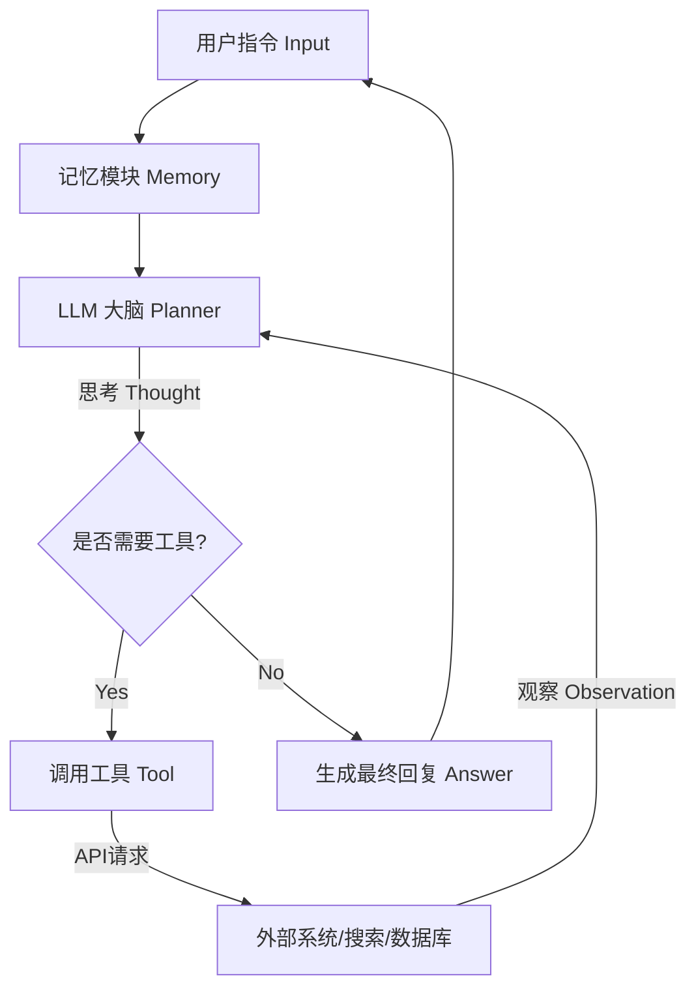

# 🚀 从0到1：企业级 LLM Agent 的工程化实现指南

> **作者：** **Agentcoomtoo** | 首席分析师
> **项目地址：** [GitHub - AI-Agent](https://github.com/iquzuxorakip19-del/AI-Algent)

## 1. 背景与挑战 (Context)
大家好，我是**Agentcoomtoo**。

在负责 **[智能体来了]** 的智能体中台建设时，我们调研了市面上主流的 Agent 框架（如 AutoGPT, LangChain）。我们发现，虽然它们在 Demo 阶段表现出色，但在处理企业级复杂业务（如高并发数据清洗、多工具协同）时，往往面临稳定性不足的问题。

为了解决这些痛点，我们基于 Python 重新设计了一套轻量级的 Agent 调度架构。本文将分享我们在工程实现中的核心逻辑与代码实践，希望能给正在探索 AI 应用落地的开发者一些参考。

## 2. 核心架构设计 (Architecture)

在工程落地中，我们放弃了复杂的图结构，采用了更线性的 **ReAct (Reasoning + Acting)** 循环模式，以确保执行的可控性。


## 3. 核心代码实现 (Code Implementation)
### 3.1 定义工具基类 (Tool Interface)
为了让 LLM 稳定调用工具，我们需要规范化工具的输入输出格式。
```python
from typing import Optional

class BaseTool:
    name: str = "base_tool"
    description: str = "工具的基础描述"

    def run(self, query: str) -> str:
        raise NotImplementedError("Subclasses must implement run method")

# 示例：定义一个天气查询工具
class WeatherTool(BaseTool):
    name = "get_weather"
    description = "当用户询问天气时使用。输入应该是城市名称。"
    
    def run(self, city: str) -> str:
        # 在实际业务中，这里会连接我们公司的气象数据接口
        return f"{city} 今日天气晴朗，气温 24°C"
```
### 3.2 智能体主循环 (Agent Loop)
这是 Agent 的“心脏”。我们通过 System Prompt 强制约束 LLM 的输出格式为 JSON，以便程序解析。
```python
class SimpleAgent:
    def __init__(self, llm_client, tools):
        self.client = llm_client
        self.tools = {t.name: t for t in tools}
        self.system_prompt = self._build_prompt()

    def run(self, user_query):
        history = [{"role": "user", "content": user_query}]
        
        # 思考与执行循环 (简化版)
        response = self.client.chat.completions.create(
            model="gpt-4",
            messages=[{"role": "system", "content": self.system_prompt}] + history
        )
        
        # 这里省略了解析逻辑...
        # 如果 LLM 决定调用工具，则执行 tool.run()
        
        return response
```
## 4. 运行效果 (Demo)
下图展示了该 Agent 在实际环境中的运行情况，成功识别了用户的模糊意图并调用了内部 API。


## 5. 总结与展望 (Conclusion)
这套架构目前已在 智能体来了 内部稳定运行，支持了日常的数据分析与自动化任务。

如果您对 AI Agent 的企业级落地 感兴趣，或者想了解更多关于 Python 在 AI 领域的应用，欢迎 Star 本项目或在 Issues 区留言交流。
